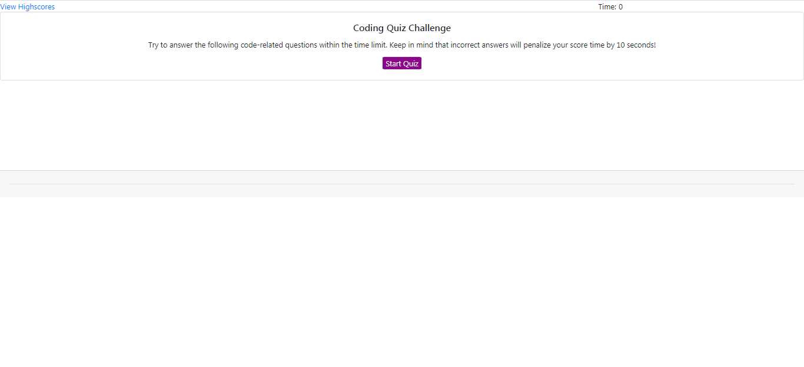
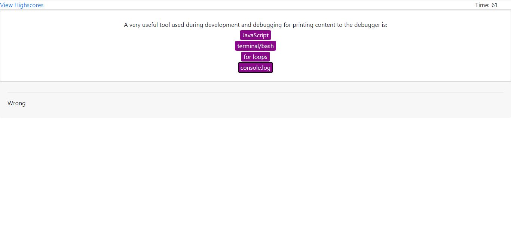

# Timed_Quiz
## Author & Contact Email
####  Tristan Eastman 
##### Email: teastman85@gmail.com

## License
#### [This project is licensed under the terms of the MIT license.](LICENSE)

## Table of Contents
* [Description](#description)
* [User-Story](#user-story)
* [Screenshots](#screenshots)
* [Link-to-Deployed-Website](#link)

## Description
#### Timed quiz game featuring javascript questions. 
#### This game saves highscores.

## Technologies Used
* [jQuery](https://jquery.com/)
* [fontawesome](https://fontawesome.com/)
* [bootstrap](https://getbootstrap.com/)

## User Story
#### AS A student.
#### I WANT a timed quiz game.
#### SO THAT I can test my coding knoweldge.

## GIF 

## Screenshots

## Link to Deployed Website
#### https://teastman201.github.io/Timed_Quiz/
